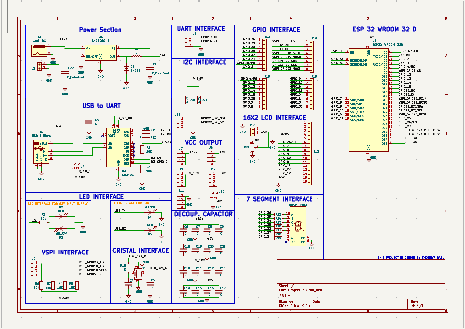
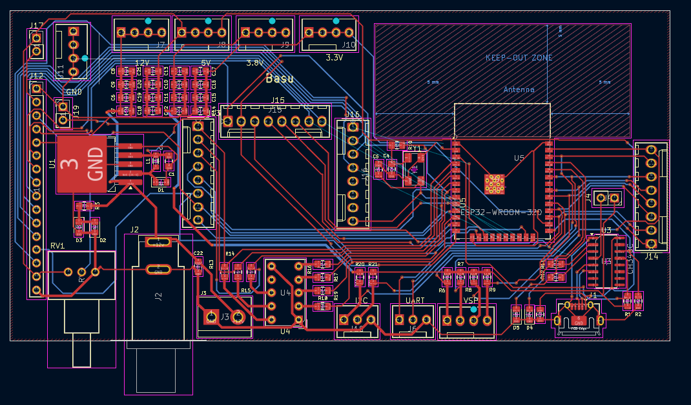
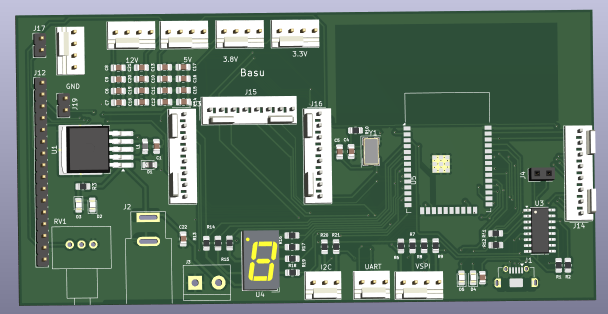

---

### Tech Stack

- Schematic – The blueprint stage where logical connections between components are defined using symbols, pins, and nets to create a functional electrical map.

- PCB Routing – The physical design process of laying down copper tracks (traces) on the board to connect components while adhering to design rules like clearance, trace width, and signal integrity.

- KiCad – An open-source EDA suite used for schematic capture and PCB layout, offering powerful tools for 3D visualization and Gerber file generation.
---

### Images

